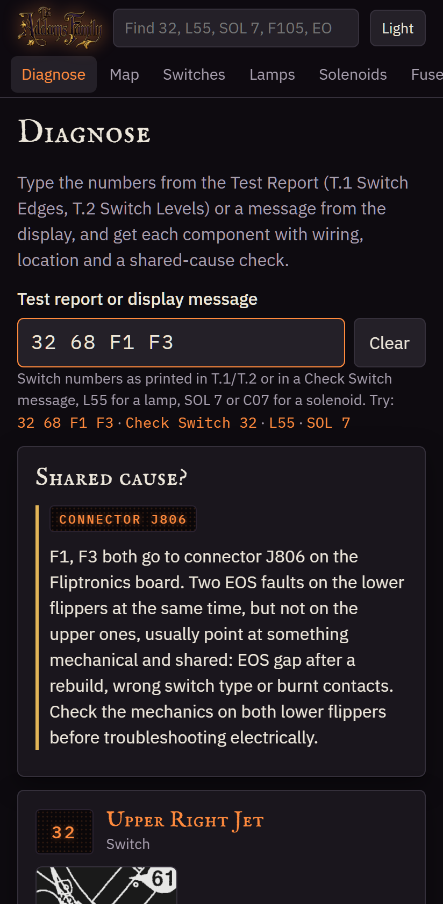
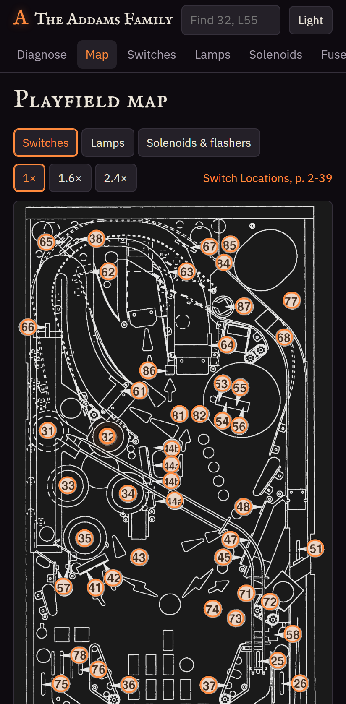
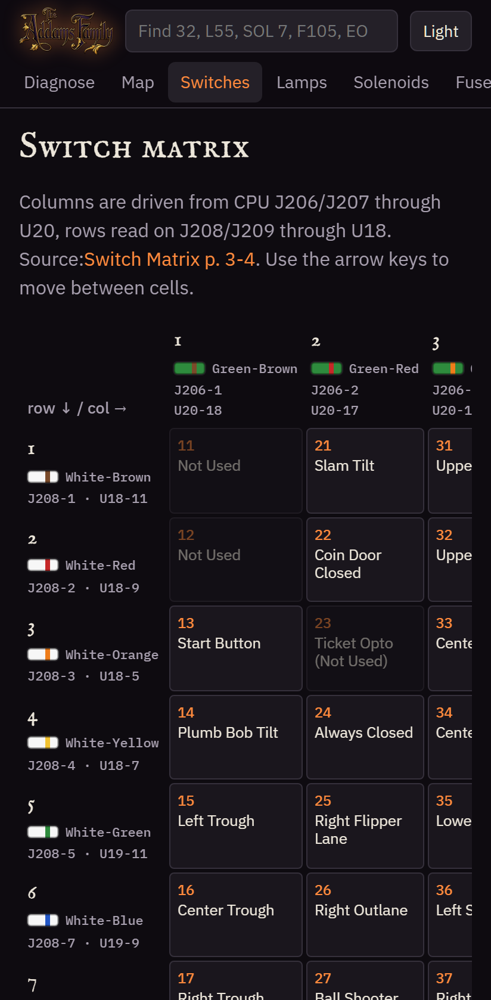
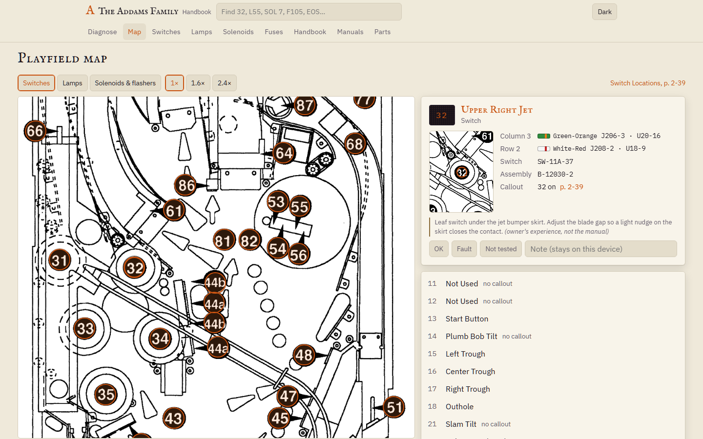
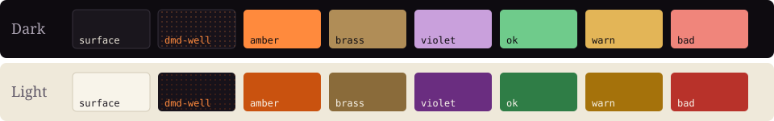

<p align="center">
  
</p>

<h1 align="center">The Addams Family Handbook</h1>

<p align="center">
  Service companion for one Bally <i>The Addams Family</i> pinball machine (1992, WPC)<br>
  <sub><code>DIAGNOSE · MAP · MATRICES · HANDBOOK · MANUALS · PARTS · OFFLINE</code></sub>
</p>

<p align="center">
  <a href="https://dsgj.github.io/TheAddamsFamilyHandbook/"></a>
  <a href="https://github.com/Dsgj/TheAddamsFamilyHandbook/actions/workflows/deploy.yml"></a>
  
  
  
  
</p>

<p align="center">
  <a href="https://dsgj.github.io/TheAddamsFamilyHandbook/"><b>Open the app</b></a>
  &nbsp;·&nbsp; <a href="#features">Features</a>
  &nbsp;·&nbsp; <a href="#quick-start">Quick start</a>
  &nbsp;·&nbsp; <a href="#deploy">Deploy</a>
  &nbsp;·&nbsp; <a href="#data-pipeline">Data</a>
  &nbsp;·&nbsp; <a href="#design">Design</a>
  &nbsp;·&nbsp; <a href="CHANGELOG.md">Changelog</a>
</p>

---

**The Addams Family Handbook** is an interactive service manual for a single Bally _The Addams
Family_ pinball machine. Type what the machine tells you, get the wiring, the
location on the playfield, the manual page and a note about what usually goes wrong. It is a static
Astro site with Svelte islands, installable as a PWA and fully usable offline under the playfield
glass.

<table>
  <tr>
    <td align="center"></td>
    <td align="center"></td>
    <td align="center"></td>
  </tr>
  <tr>
    <td align="center"><sub><b>Diagnose</b> · paste <code>32 68 F1 F3</code></sub></td>
    <td align="center"><sub><b>Playfield map</b> · switch layer</sub></td>
    <td align="center"><sub><b>Switch matrix</b> · 8×8 + tables</sub></td>
  </tr>
</table>



<p align="center"><sub>Dark on the phone in the workshop, light on the desk. The toggle lives in the header.</sub></p>

## Features

|                       |                                                                                                                                                                                                           |
| --------------------- | --------------------------------------------------------------------------------------------------------------------------------------------------------------------------------------------------------- |
| **Diagnose**          | Paste a Test Report line, a whole report or a display message. One card per component with wiring chips, mini-map, callout link, status + note, and a shared-cause check across switch and lamp columns and rows, connectors and EOS mechanics. |
| **Playfield map**     | Switch, lamp and solenoid layers at three zoom levels. Markers take the colour of their status. `?layer&id` in the URL, so a link opens the same view.                                                    |
| **Matrices & tables** | 8×8 switch and lamp matrices with keyboard navigation. Dedicated tables for J205, Fliptronics J806, solenoids, flashers, flipper coils, GI, fuses by board, LEDs and the jumper pointer.                  |
| **Handbook**          | 56 transcribed pages in 10 sections with page markers, scan links, menu map and a searchable table of contents. `#find:` and `#goto:` links resolve at build time.                                        |
| **Manuals**           | Viewer for the three scanned documents (ops 124 pp, handbook 12 pp, WPC schematics 14 pp with tiles). Fit, zoom, rotate, text mode and OCR search across all of them.                                     |
| **Parts**             | 2 562 rows with assembly path. Search from two characters.                                                                                                                                                |
| **Quick search**      | Components and handbook headings from the header on every page.                                                                                                                                           |
| **Status**            | OK / Fault / Not tested and a note per component, stored on the device, with a service log of the last changes. A Broken tick in the lamp, switch and solenoid tables sets Fault in one tap.            |
| **Shopping list**     | Every part marked Fault, grouped by bulb type or part number with counts and assembly, linked to the cards. Copy as text, and a Fixed button per part so it doubles as a work list.                       |
| **Verify**            | The open questions from the data (flasher count, EOS switch type, hand-placed callouts, unchecked pages) as a checklist with links, ticked on the device.                                                 |
| **Machine setup**     | Six-step guide for presets, adjustments, high scores, H-4 ROM extras and utilities after a move, with suggested values, reasons, Handbook links and a field for what the machine is set to.        |
| **Device data**       | Download every status as a JSON backup and read it back on another phone, merge or replace.                                                                                                              |
| **Offline**           | Manifest, icons, precached shell, data, maps and figures. Scans are cached on first view.                                                                                                                 |

Every data caveat is rendered as a provenance note next to the affected value. See
[`CHANGELOG.md`](CHANGELOG.md) and [`kit-docs/KNOWN-ISSUES.md`](kit-docs/KNOWN-ISSUES.md).

## Quick start

```sh
pnpm install
pnpm dev            # http://localhost:4321
pnpm build          # dist/
pnpm preview
```

### Gates

| Command         | Checks                                                                          |
| --------------- | ------------------------------------------------------------------------------- |
| `pnpm check`    | `astro check` + `tsc --noEmit`                                                  |
| `pnpm lint`     | ESLint (Astro + Svelte)                                                         |
| `pnpm test`     | Vitest: codes, shared cause, handbook build                                     |
| `pnpm test:e2e` | Playwright smoke tests, `phone-dark` and `desktop-light` against `pnpm preview` |

## Deploy

- **GitHub Pages** (chosen target). [`.github/workflows/deploy.yml`](.github/workflows/deploy.yml)
  builds with `BASE_PATH=/<repo name>/` and publishes `dist/`. In the repo settings, set Pages →
  Source to "GitHub Actions".
- **Docker**. `docker compose up --build` serves on <http://localhost:8080>. Pass
  `--build-arg BASE_PATH=/TheAddamsFamilyHandbook/` to serve under a sub-path. _Untested locally_
  (no Docker here).
- `BASE_PATH` must start and end with `/`. In Git Bash prefix `MSYS_NO_PATHCONV=1`, otherwise MSYS
  rewrites the path into a Windows path.

## Data pipeline

All data is copied from the kit in the sibling folder `../kit`. Nothing is edited here.

```
kit/data      ─►  src/data/kit + public/data       ┐
kit/assets    ─►  public/assets                    │  pnpm sync-kit
kit/handbook  ─►  src/content/handbook             │
kit/docs      ─►  kit-docs                         ┘
@fontsource   ─►  public/fonts                        pnpm fonts
icon.svg      ─►  public/icons/*.png                  pnpm icons
scans         ─►  page thumbnails (optional)          pnpm thumbs
```

Handbook pages are rendered by a custom content loader
([`src/lib/handbook/loader.ts`](src/lib/handbook/loader.ts)) that turns `#find:CODE` and
`#goto:ops:N` links into real anchors. Swedish wiring names in the source data are mapped to the
English UI in [`src/lib/data/en.ts`](src/lib/data/en.ts).

## Project layout

```
src/
├── components/   Svelte islands: Diagnose, PlayfieldMap, Matrix, PageViewer, PartsList, …
├── lib/          codes, shared-cause, handbook loader + renderer, data mapping, status model
├── pages/        diagnose (index), map, switches, lamps, coils, fuses, parts, handbook, manual
├── styles/       tokens.css (palette, type, spacing), base.css
└── content/      handbook pages (synced from the kit)
public/           data, assets, fonts, icons (synced or generated), brand/logo.webp
scripts/          sync-kit, copy-fonts, icons, thumbnails
tests/            vitest + Playwright e2e
kit-docs/         build prompt, machine notes, known issues (synced from the kit)
```

## Design

The look borrows from the machine itself: a dot-matrix amber on a near-black cabinet, brass rails,
a touch of Gomez's violet, and an old-book display face for headings.



| Role                   | Face               |
| ---------------------- | ------------------ |
| Display                | IM Fell English SC |
| Body                   | IBM Plex Sans      |
| Codes, wiring, numbers | IBM Plex Mono      |

Fonts are self-hosted from `public/fonts` so they load under any base path. Dark is the default;
the light theme follows `prefers-color-scheme` or the header toggle. Tokens live in
[`src/styles/tokens.css`](src/styles/tokens.css).

## Decisions

Recorded from the owner (§10 of the build prompt):

- UI language is **English throughout**.
- App name is **The Addams Family Handbook**, short name **TAF Handbook** (renamed from Valvet on
  2026-09-23; the project folder keeps its old name). Deploy target is GitHub Pages.
- Service log and photos stay local on the device (M2+). Per-component status lives in
  `localStorage` under `tafh:status` until M2 introduces the storage adapter.
- The project lives in the sibling folder `../valvet`; the kit is read-only source.
- Astro 7 instead of the Astro 5 the prompt mentions. `pnpm-workspace.yaml` sets
  `minimumReleaseAge: 0` so current releases install.
- Repo [Dsgj/TheAddamsFamilyHandbook](https://github.com/Dsgj/TheAddamsFamilyHandbook) is public by
  owner decision. The scans are Williams/Midway copyright material; the owner accepted publishing
  them.

## Roadmap

- [x] **M1 — Foundation and parity.** Everything the prototype did, rebuilt as an installable static
      site. Deployed.
- [ ] **M2 — Storage.** Dexie storage adapter, service log seeded from
      [`kit-docs/MACHINE.md`](kit-docs/MACHINE.md), photos.
