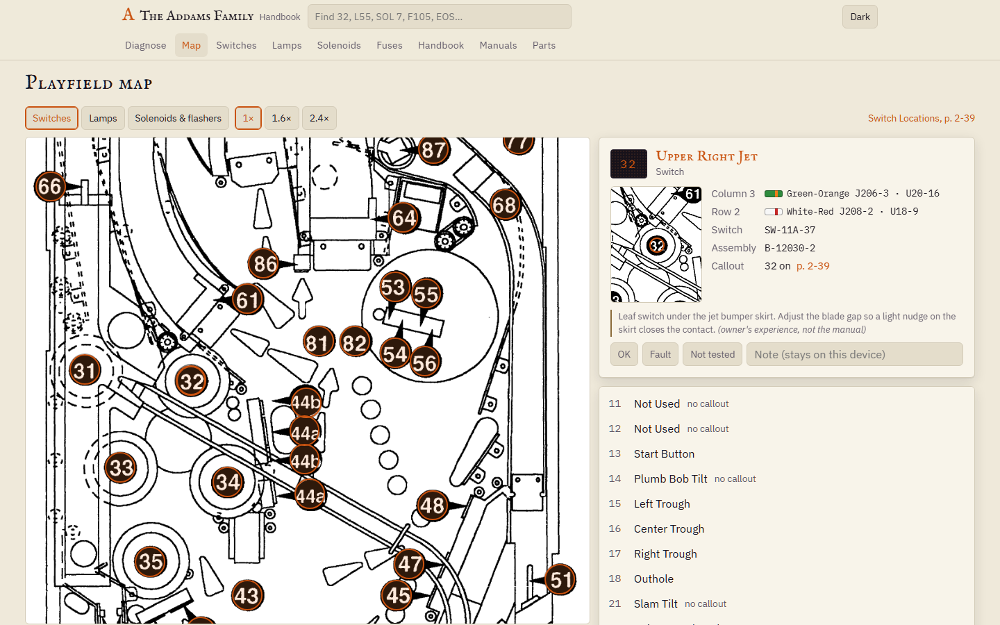
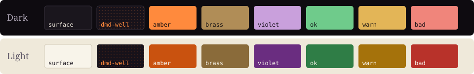

# The Addams Family Handbook


Service companion for one Bally _The Addams Family_ pinball machine (1992, WPC)
`DIAGNOSE · MAP · TABLES · HANDBOOK · WORKSHOP · OFFLINE`

[](https://dsgj.github.io/TheAddamsFamilyHandbook/)
[](https://github.com/Dsgj/TheAddamsFamilyHandbook/actions/workflows/deploy.yml)


[**Open the app**](https://dsgj.github.io/TheAddamsFamilyHandbook/) ·
[Features](#features) · [Quick start](#quick-start) · [Deploy](#deploy) ·
[Data](#data-pipeline) · [Design](#design) · [Changelog](CHANGELOG.md)

---

**The Addams Family Handbook** is a service app for a single Bally _The Addams
Family_ pinball machine. Type what the machine tells you, get the wiring, the
location on the playfield, the manual page and a note about what usually goes
wrong. It is a static Astro site with Svelte islands, installable as a PWA and
fully usable offline under the playfield glass.

The app is organised in five tabs (Diagnose, Map, Tables, Handbook, Workshop),
the result of a twelve-phase redesign in September 2026 and of the app audit
that followed it in two rounds (fixes P0–P4, see the [changelog](CHANGELOG.md)).

|      Diagnose       |       Playfield map       | Switch matrix |
| :-----------------: | :-----------------------: | :-----------: |
|   ![Diagnose][s1]   |        ![Map][s2]         | ![Matrix][s3] |
| paste `32 68 F1 F3` | switch layer, one drawing | 8×8 + tables  |

[s1]: docs/readme/phone-diagnose.png
[s2]: docs/readme/phone-map.png
[s3]: docs/readme/phone-switches.png



_Dark on the phone in the workshop, light on the desk. Workshop › Appearance
switches between System, Dark and Light._

## Features

- **Diagnose.** Paste a Test report line, a whole report or a display message.
  One card per component with wiring chips, a mini-map on the playfield
  drawing, callout link, status + note, and a shared-cause check across switch and lamp columns and rows,
  connectors and EOS mechanics.
- **Playfield map.** One clean line drawing of the playfield with switch,
  lamp, solenoid and shot layers (the manual's lettered shots A–S), any
  combination, at three zoom levels. The selected component pulses and the rest
  dims; markers take the colour of their status. Positions were remapped from
  the manual's three location maps and two shot maps, then placed by hand by
  the owner against the manual pages. `?layer=sw,shot&id=K` in the URL, so a
  link opens the same view, and the rules section of the handbook embeds the
  map with the shots on. `?calib=1` is the calibration mode: drag or arrow-key
  markers over a frame-aligned overlay of the manual page and copy the JSON
  into `src/data/positions.json`.
- **Tables.** The switch matrix and the lamp matrix (8×8) with keyboard
  navigation, and tables for the dedicated switches (J205), the flipper
  switches (Fliptronics J805/J806), solenoids and flashers, flipper coils, GI, fuses
  by board, LEDs and jumpers. Codes read the same everywhere: switch `32`,
  lamp `L55`, solenoid `SOL 01`.
- **Handbook.** 64 transcribed pages (56 from the Operations Manual, 8
  appendix) in 11 sections with page markers, links to the manual pages, a menu
  map and a searchable table of contents. `#find:` and `#goto:` links resolve
  at build time.
- **Manuals.** Viewer for the three manuals (Operations Manual 124 pages,
  Operator's Handbook 12 pages, WPC Schematic Manual 14 pages with tiles). Fit,
  zoom, rotate, a text mode and a search of the page text across all of them.
- **Parts.** 2 562 rows with assembly path. Search from two characters.
- **Search.** A word typed on Diagnose searches components, handbook headings,
  the manuals' page text and parts at once.
- **Status.** OK / Fault / Not tested and a note per component, stored on the
  device, with a dated service log of the last changes. A Fault tick in the
  lamp, switch and solenoid tables sets Fault in one tap.
- **Shopping list.** Every component marked Fault, grouped by bulb type or part
  number with counts and assembly, linked to the cards. Copy as text, and a
  Fixed button per component so it doubles as a work list.
- **Verify.** The open questions from the data (flasher count, EOS switch type,
  hand-placed callouts, unchecked pages) as a checklist with links, ticked on
  the device.
- **Machine setup.** Seven-step guide for presets, adjustments, high scores, H-4
  ROM extras, utilities after a move and upgrades/upkeep, with suggested values,
  reasons, Handbook links and a field for what the machine is set to.
- **Care.** Cleaning and upkeep by interval (weekly, monthly, twice a year,
  yearly) with the product or method per item, what the manual says, and a dated
  tick per item stored on the device.
- **Handbook appendix.** Notes written for this machine, after the manual's
  pages in the handbook: multimeter basics, coils, switches and optos, lamps and GI, the power driver board,
  flippers, connectors and cleaning, shopping out the playfield. Sourced per section; linked from every
  component page as "Service notes".
- **Device data.** Download a backup of everything recorded on the device
  (status, notes, the service log, setup values, care and verify ticks) and
  restore it on another phone, merging or replacing what is there.
- **Workshop.** The hub for the shopping list, Verify, care, machine setup,
  device data, the appearance setting, installing the app and About the app.
- **Offline.** Manifest, icons, precached shell and hubs, data and the
  playfield drawing; the handbook, manual and component pages and the
  handbook's figures are saved in the background after the first install.
  Manual pages (and the calibration overlays) are saved on the device on
  first view.

## Quick start

```sh
pnpm install
pnpm dev            # http://localhost:4321
pnpm build          # dist/
pnpm preview
```

### Gates

| Command             | Checks                                                                                                                                                                                               |
| ------------------- | ---------------------------------------------------------------------------------------------------------------------------------------------------------------------------------------------------- |
| `pnpm check`        | `astro check` + `tsc --noEmit`                                                                                                                                                                       |
| `pnpm svelte-check` | svelte-check after astro sync                                                                                                                                                                        |
| `pnpm lint`         | ESLint (Astro, Svelte, the Playwright specs; type-aware on `src/`), no warnings allowed                                                                                                              |
| `pnpm format:check` | Prettier, LF everywhere                                                                                                                                                                              |
| `pnpm test`         | Vitest: codes, shared cause, handbook build, copy rules, map zoom, built links and payload, workflow shape (the last two read `dist/`, which must be newer than the sources: run `pnpm build` first) |
| `pnpm test:e2e`     | Playwright: phone-dark, desktop-light and phone-webkit (390×844), incl. axe on 26 routes; with `BASE_PATH` set also `subpath`, the `@subpath` specs under that base; run `pnpm build` first          |

## Deploy

Every push to main and every pull request runs the gates; main deploys once they are green.
One build feeds the unit tests and the three e2e projects; the Pages job builds again under its
base and runs the link check and the `subpath` e2e project on that build; the Docker job builds
and smoke-tests the image. A test that passed only on its retry is listed in the e2e job's
summary.

- **GitHub Pages** (chosen target).
  [`.github/workflows/deploy.yml`](.github/workflows/deploy.yml) builds with
  `BASE_PATH=/<repo name>/` and publishes `dist/`. In the repo settings, set
  Pages → Source to "GitHub Actions".
- **Docker**. `docker compose up --build` serves on <http://localhost:8080>.
  Pass `--build-arg BASE_PATH=/TheAddamsFamilyHandbook/` to serve under a
  sub-path. CI builds the image under `/sub/` and runs
  [`scripts/docker-smoke.sh`](scripts/docker-smoke.sh) on it (pages, the 404,
  the cache headers, gzip); `sh scripts/docker-smoke.sh podman` runs the same
  check locally.
- `BASE_PATH` must start and end with `/`. In Git Bash prefix
  `MSYS_NO_PATHCONV=1`, otherwise MSYS rewrites the path into a Windows path.

### Release check on the iPhone

Playwright's WebKit cannot go offline, so the owner's phone is checked by hand
after a release that touches the service worker, the precache or the manual
pages: open the installed app once online and wait for "Ready to work
offline", switch on flight mode, then open Diagnose with a `?q=` search, the
Map, a handbook section and a manual page opened before. Each must load; a
manual page not opened before says it isn't on the device yet.

## Data pipeline

All data is copied from the kit in the sibling folder `../kit`, and the copies
are never edited here: the owner's corrections live in
[`src/data/ownerNotes.ts`](src/data/ownerNotes.ts).

```text
kit/data      ─►  src/data/kit + public/data       ┐
kit/assets    ─►  public/assets                    │  pnpm sync-kit
kit/handbook  ─►  src/content/handbook             │
kit/docs      ─►  kit-docs                         ┘
@fontsource   ─►  public/fonts                        pnpm fonts
icon.svg      ─►  public/icons/*.png (+ iOS splash)    pnpm icons
page images   ─►  page thumbnails (optional)          pnpm thumbs
```

`pnpm sync-kit` is a dry run: it prints what each file would do and writes
nothing. `pnpm sync-kit -- --write` copies the files marked `new` and
`update`. Only the files on the script's copy list are copied (the data the
app reads, `ops*.md`, the assets, `tools/*.py`, the docs), and nothing is ever
deleted. The manifest `src/data/kit/kit-sync.json` records the sha256 of each
kit file as last synced: a copy that no longer matches it was edited here and
is skipped, never overwritten, and a copy with no record that differs from the
kit (four of the `kit-docs`) is reported as diverged. `--write` refuses while
git shows changes under the destinations, and `tests/unit/kit.test.ts` fails on
any hand edit to a synced file. The owner's corrections live in
`src/data/ownerNotes.ts` and the translations in `src/lib/data/en.ts`; both
are applied once per build, so restart `astro dev` after editing them.

Handbook pages are rendered by a custom content loader
([`src/lib/handbook/loader.ts`](src/lib/handbook/loader.ts)) that turns
`#find:CODE` and `#goto:ops:N` links into real anchors. The kit's component
data is Swedish-authored: a Vite plugin
([`src/build/kit-plugin.ts`](src/build/kit-plugin.ts)) translates it to the
English model once at build time, with the dictionaries in
[`src/lib/data/en.ts`](src/lib/data/en.ts) and the owner's notes, printed
fuses and wire colours from `ownerNotes.ts`, and fails the build on a value it
has no English for. Only `src/lib/kit/` imports `src/data/kit`.

Three things are this repo's own and not synced from the kit:

- [`src/data/positions.json`](src/data/positions.json): marker positions on
  the clean drawing `public/assets/maps/playfield.png`, keyed `kind:id`
  (`switch`, `lamp`, `coil`, `shot`), normalised 0–1. Seeded from the kit's
  `loc` callouts and the shot-map arrow tips, then calibrated by hand in
  `/map?calib=1`. The kit's `loc` stays untouched; the manual's three location
  maps it refers to are kept only as calibration overlays.
- [`src/data/shots.ts`](src/data/shots.ts): the lettered shots A–S with their
  manual page.
- [`src/data/overlays.json`](src/data/overlays.json): where each manual location
  map sits over the drawing so its playfield frame lines up (computed once by
  frame detection).

## Project layout

```text
src/
├── build/        kit-plugin.ts, the Vite plugin that translates the kit's data
├── components/   Svelte islands: Diagnose, PlayfieldMap, Matrix, PageViewer, …
├── layouts/      Base.astro (the shell) and ComponentPage.astro
├── data/         kit/ (synced), positions.json, shots.ts, overlays.json, owner data
├── lib/          codes, shared cause, handbook loader, kit translation, data mapping,
│                 positions, status
├── pages/        22 routes: index (Diagnose), map, tables, switches, lamps,
│                 coils, fuses, switch/[id], lamp/[id], coil/[id], flipper/[id],
│                 handbook/index, handbook/[section], manual/index,
│                 manual/[doc]/[page], parts, workshop, shopping, verify, care,
│                 setup, 404; plus data/handbook.json.ts and
│                 data/ocr-text.json.ts (JSON endpoints, not pages)
├── styles/       tokens.css (palette, type, spacing), base.css and one sheet per
│                 pattern: buttons, controls, layout, lists, nav, surfaces, content,
│                 motion, print
└── content/      handbook/: the manual's pages (ops*.md, synced from the kit) and
                  the handbook appendix (app*.md, written here)
public/           data, assets, fonts, icons (synced or generated), brand/logo.webp
scripts/          sync-kit, copy-fonts, icons, thumbnails
tests/            vitest + Playwright e2e
kit-docs/         build prompt, data schema, machine notes, knowledge bank, known issues,
                  the playfield's source drawing (not served)
```

## Design

The look borrows from the machine itself: a dot-matrix amber on a near-black
cabinet, brass rails, a touch of Gomez's violet, and an old-book display face
for headings.



| Role                   | Face               |
| ---------------------- | ------------------ |
| Display                | IM Fell English SC |
| Body                   | IBM Plex Sans      |
| Codes, wiring, numbers | IBM Plex Mono      |

Fonts are self-hosted from `public/fonts` so they load under any base path. Dark
is the default; the light theme follows `prefers-color-scheme` or the choice in
Workshop › Appearance (System, Dark, Light). Tokens live in [`src/styles/tokens.css`](src/styles/tokens.css).

## Decisions

Recorded from the owner (§10 of the build prompt):

- UI language is **English throughout**.
- App name is **The Addams Family Handbook**, "the app" in running text. The
  short name **TAF Handbook** is only the home-screen label (manifest
  `short_name` and the Apple title). Renamed from Valvet on 2026-09-23; the
  project folder keeps its old name.
  Deploy target is GitHub Pages.
- Service log and photos stay local on the device (M2+). Per-component status
  lives in `localStorage` under `tafh:status` until M2 introduces the storage
  adapter.
- The project lives in the sibling folder `../valvet`; the kit is read-only
  source.
- One clean playfield drawing with combinable layers instead of the prompt's
  three location diagrams with markers at the printed callouts. The manual's
  callouts remain in the kit data; the app's positions were calibrated by the
  owner on 2026-09-24.
- Astro 7 instead of the Astro 5 the prompt mentions. pnpm 12's 24 h
  release-age quarantine stays on; a fix that cannot wait exempts its one
  package with `minimumReleaseAgeExclude` in `pnpm-workspace.yaml`.
- Repo
  [Dsgj/TheAddamsFamilyHandbook](https://github.com/Dsgj/TheAddamsFamilyHandbook)
  is public by owner decision. The manual page images are Williams/Midway
  copyright material; the owner accepted publishing them.

## Roadmap

- [x] **M1 — Foundation and parity.** Everything the prototype did, rebuilt as
      an installable static site. Deployed.
- [ ] **M2 — Storage.** Dexie storage adapter, service log seeded from
      [`kit-docs/MACHINE.md`](kit-docs/MACHINE.md), photos.
